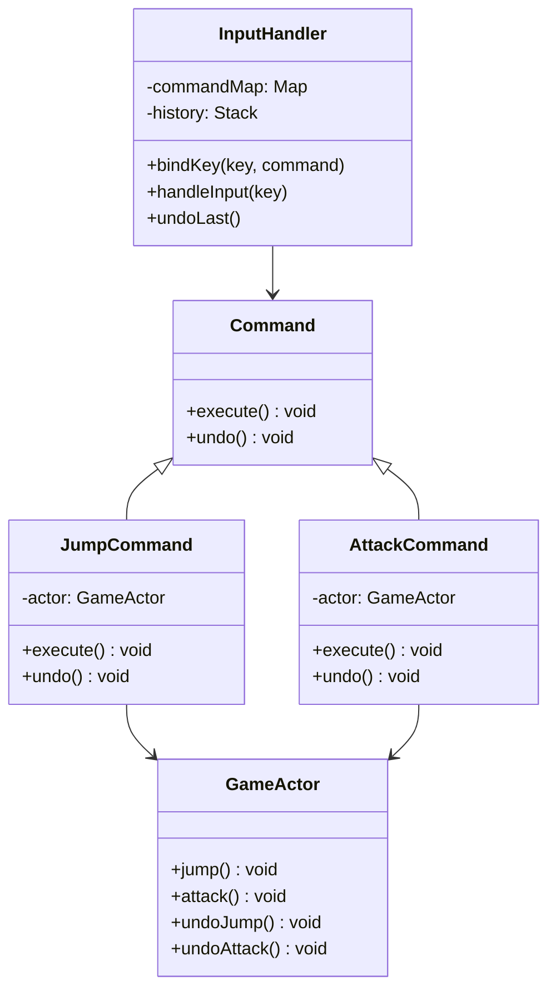
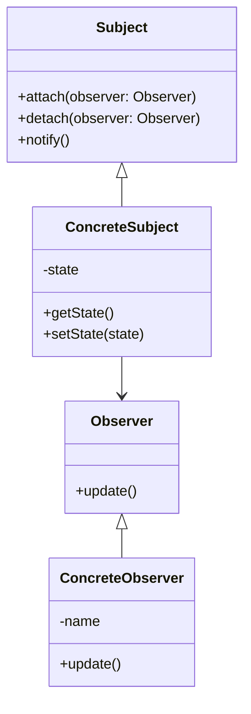

# 行为型模式

## 1.1 命令模式

### 1.1.1 描述和结构

 命令模式（Command Pattern）是一种**行为型设计模式**，它将一个请求封装为一个对象，从而允许你用不同的请求对客户进行参数化、对请求排队、记录日志以及支持撤销操作等。

```ts
// 命令接口
interface Command {
    execute(): void;
    undo(): void;
}

// 接收者：真正执行操作的对象
class GameActor {
    jump() { console.log("角色跳跃"); }
    attack() { console.log("角色攻击"); }
    undoJump() { console.log("撤销跳跃"); }
    undoAttack() { console.log("撤销攻击"); }
}

// 具体命令
class JumpCommand implements Command {
    constructor(private actor: GameActor) {}
    execute() { this.actor.jump(); }
    undo() { this.actor.undoJump(); }
}

class AttackCommand implements Command {
    constructor(private actor: GameActor) {}
    execute() { this.actor.attack(); }
    undo() { this.actor.undoAttack(); }
}

// 调用者
class InputHandler {
    private commandMap: Record<string, Command> = {};
    private history: Command[] = [];

    bindKey(key: string, command: Command) {
        this.commandMap[key] = command;
    }

    handleInput(key: string) {
        const command = this.commandMap[key];
        if (command) {
            command.execute();
            this.history.push(command);
        }
    }

    undoLast() {
        const command = this.history.pop();
        if (command) {
            command.undo();
        }
    }
}

```

---




---

### 1.1.2 用途

**用处**

- **解耦调用者与接收者**：调用者只需要调用 `command.execute()`，不需要关心如何处理。
- **支持撤销/重做**：通过维护命令历史记录，实现撤销与重做操作。
- **支持宏命令、组合命令**：多个命令打包执行。
- **延迟执行命令**：命令可以放入队列中延迟执行。

**应用场景**

- UI按钮点击行为、热键绑定
- 游戏角色行为控制（跳跃、攻击、撤销）
- 操作日志记录、事务回滚
- 命令队列、任务调度系统

---

### 1.1.3 优缺点

| 优点                   | 缺点                     |
| ---------------------- | ------------------------ |
| 解耦请求发送者和接收者 | 类数量会显著增加         |
| 易于扩展新命令         | 对于简单操作可能过于复杂 |
| 支持撤销/重做          | 实现撤销逻辑需额外工作   |
| 支持宏命令和队列命令   |                          |


以下是对**观察者模式（Observer Pattern）**的系统总结，遵循您之前提供的格式，并作为第 2 节内容呈现。

------

## 2. 观察者模式

### 2.1 描述与结构

观察者模式是一种**行为型设计模式**，用于定义对象间的一种**一对多**的依赖关系。当一个对象的状态发生改变时，所有依赖于它的对象都会收到通知并自动更新。

该模式主要涉及以下角色：

- **Subject（主题/被观察者）**：维护观察者列表，提供注册、注销和通知观察者的方法。
- **Observer（观察者）**：定义接收通知的接口。
- **ConcreteSubject（具体主题）**：实现 Subject 接口，状态发生变化时通知所有观察者。
- **ConcreteObserver（具体观察者）**：实现 Observer 接口，接收到通知后更新自身状态。




------

### 2.2 用途

**适用场景：**

- 当一个对象的状态变化需要通知其他对象，并且不希望这些对象之间紧密耦合时。
- 实现事件处理系统，如 GUI 事件监听、订阅-发布系统等。
- 模型-视图（Model-View）模式中，模型数据变更需要更新视图。

**实际案例：**

- 新闻发布系统：当有新新闻发布时，所有订阅用户都会收到通知。
- 股票价格更新：投资者订阅股票，当价格变化时收到通知。
- 社交媒体通知：用户关注某人，当该用户发布新内容时，关注者收到通知。

------

### 2.3 优缺点

**优点：**

- **解耦**：主题和观察者之间是抽象耦合，便于独立扩展和维护。
- **动态联动**：当主题状态变化时，所有观察者都会自动接收到通知。
- **支持广播通信**：一个主题可以通知多个观察者，实现一对多的通信机制。

**缺点：**

- **可能引起性能问题**：如果观察者数量众多，通知过程可能耗费较多时间。
- **通知顺序不确定**：观察者的通知顺序可能无法控制，导致状态不一致。
- **可能导致循环依赖**：不当的设计可能引起循环调用，导致系统崩溃。

------

### 2.4 示例代码

示例1：

```ts
// Observer 接口
interface Observer {
    update(message: string): void;
}

// Subject 接口
interface Subject {
    attach(observer: Observer): void;
    detach(observer: Observer): void;
    notify(message: string): void;
}

// 具体主题
class ConcreteSubject implements Subject {
    private observers: Observer[] = [];

    attach(observer: Observer): void {
        this.observers.push(observer);
    }

    detach(observer: Observer): void {
        this.observers = this.observers.filter(obs => obs !== observer);
    }

    notify(message: string): void {
        for (const observer of this.observers) {
            observer.update(message);
        }
    }
}

// 具体观察者
class ConcreteObserver implements Observer {
    constructor(private name: string) {}

    update(message: string): void {
        console.log(`${this.name} received message: ${message}`);
    }
}

// 使用示例
const subject = new ConcreteSubject();

const observer1 = new ConcreteObserver("Observer 1");
const observer2 = new ConcreteObserver("Observer 2");

subject.attach(observer1);
subject.attach(observer2);

subject.notify("Hello Observers!"
```

输出：

```
Observer 1 received message: Hello Observers!
Observer 2 received message: Hello Observers!
```

cocos示例2

```ts
// 定义一个全局事件中心
const EventCenter = new EventTarget();

// 组件 A：发出事件
@ccclass
export class ComponentA extends Component {
    onSomeAction() {
        // 触发事件，传递数据
        EventCenter.emit('score-changed', 100);
    }
}

// 组件 B：监听事件
@ccclass
export class ComponentB extends Component {
    onLoad() {
        // 注册事件监听
        EventCenter.on('score-changed', this.onScoreChanged, this);
    }

    onScoreChanged(newScore: number) {
        // 更新 UI 显示
        console.log(`Score updated to: ${newScore}`);
    }

    onDestroy() {
        // 移除事件监听
        EventCenter.off('score-changed', this.onScoreChanged, this);
    }
}

```


------

