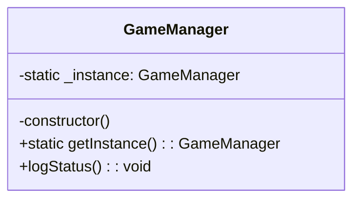
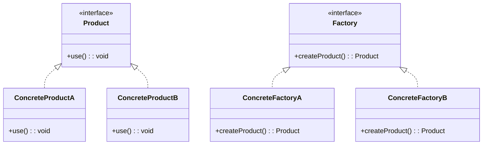

# 创建型模式

[TOC]

## 1 单例模式(singleton)

### 1.1 描述和结构

单例模式（Singleton Pattern）是一种**创建型设计模式**，它确保某个类在系统中**只有一个实例**，并提供一个全局访问点来访问这个实例。

主要用于：

* 全局唯一资源管理器（如游戏的音频控制器、配置管理器、日志器等）
* 管理共享状态（如游戏状态、计分系统等）

```ts
// 单例类
class AudioManager {
    private static _instance: AudioManager;

    private constructor() {}

    static getInstance(): AudioManager {
        if (!AudioManager._instance) {
            AudioManager._instance = new AudioManager();
        }
        return AudioManager._instance;
    }

    playSound(name: string) {
        console.log(`播放音效：${name}`);
    }
}

// 使用
const audio1 = AudioManager.getInstance();
const audio2 = AudioManager.getInstance();
console.log(audio1 === audio2); // true
audio1.playSound("jump");

```

---



---

### 1.2 用途

**用处**

* 控制资源访问：例如音频控制器、数据库连接池、线程池等
* 管理共享状态或配置
* 保证全局唯一性，避免资源冲突

**常见应用场景**

* 游戏管理器（GameManager）
* 日志记录器（Logger）
* 配置读取器（ConfigManager）
* 缓存对象池、网络连接管理器

---

### 1.3  创建方式

- **懒加载（Lazy）**：延迟到第一次调用 `getInstance()` 时再创建实例。
- **饿加载（Eager）**：在类加载/模块加载时立即创建实例。

------

####  懒加载（Lazy Singleton）

> 优点：延迟创建实例，节省资源。
>  缺点：首次访问时有一点初始化开销。

```ts
class LazySingleton {
    private static _instance: LazySingleton | null = null;

    private constructor() {
        console.log("LazySingleton 实例创建");
    }

    public static getInstance(): LazySingleton {
        if (this._instance === null) {
            this._instance = new LazySingleton();
        }
        return this._instance;
    }

    sayHello() {
        console.log("Hello from LazySingleton");
    }
}
```

使用：

```ts
const lazy = LazySingleton.getInstance(); // 输出：LazySingleton 实例创建
lazy.sayHello();
```

------

#### 饿加载（Eager Singleton）

> 优点：类加载时立即创建实例，使用时无等待。
>  缺点：如果从未使用该实例，也会占用内存。

```ts
class EagerSingleton {
    private static readonly _instance: EagerSingleton = new EagerSingleton();

    private constructor() {
        console.log("EagerSingleton 实例创建");
    }

    public static getInstance(): EagerSingleton {
        return this._instance;
    }

    sayHello() {
        console.log("Hello from EagerSingleton");
    }
}
```

使用：

```ts
const eager = EagerSingleton.getInstance(); // 输出：EagerSingleton 实例创建（首次 import 或使用时就创建了）
eager.sayHello();
```

------

模块级饿加载（ES Module 单例）

> 利用 ES 模块特性，每个模块只会初始化一次：

```ts
// Config.ts
export class Config {
    private config: Record<string, string> = {};

    set(key: string, value: string) {
        this.config[key] = value;
    }

    get(key: string) {
        return this.config[key];
    }
}

export const config = new Config(); // 模块级单例
```

使用：

```ts
import { config } from "./Config";

config.set("volume", "80");
console.log(config.get("volume")); // 80
```

------

#### 总结

| 特性         | 懒加载                      | 饿加载                   |
| ------------ | --------------------------- | ------------------------ |
| 创建时机     | 首次调用 `getInstance()` 时 | 类或模块加载时立即创建   |
| 是否延迟加载 | 是                          | 否                       |
| 是否占用资源 | 不占资源（首次）            | 占用资源（无论是否使用） |
| 实现复杂度   | 稍复杂，需要条件判断        | 简单                     |
| 推荐使用场景 | 大型项目，资源敏感、启动慢  | 小型项目，简单管理类     |


---


### 1.4 优缺点

| 优点               | 缺点                   |
| ---------------- | -------------------- |
| 保证系统中只有一个实例，节省资源 | 多线程环境下需要考虑线程安全       |
| 提供全局访问点，易于管理     | 隐式依赖全局状态，违背部分面向对象原则  |
| 可延迟初始化，提升性能      | 不易扩展，尤其在单元测试中难以模拟或替换 |
| 易于实现，适合小型管理类     | 滥用可能引发全局依赖、代码耦合      |

| 注意事项             | 说明                                                         |
| -------------------- | ------------------------------------------------------------ |
| **全局状态风险**     | 单例通常作为全局对象，若管理不当可能引发全局状态污染，导致难以测试和维护。 |
| **懒加载 vs 饿加载** | 懒加载在首次使用时才创建对象，节省资源；饿加载在模块加载时就创建实例，适合轻量场景。 |
| **线程安全问题**     | 在多线程环境中必须加锁防止并发创建多个实例（JS/TS 无需）。   |
| **无法继承扩展**     | 单例类通常不支持继承（构造器是 private），扩展性较差。       |
| **不利于测试**       | 因为是全局状态，写单元测试时容易受到之前测试的污染。应提供 `reset()` 等方法模拟干净环境。 |
| **注意内存泄漏**     | 如果单例中保存了大量引用对象，且生命周期过长，要注意及时清理无用数据。 |

---


## 2 工厂模式（Factory Pattern）

### 2.1 描述和结构

工厂模式是一类用于**封装对象创建**过程的创建型设计模式，屏蔽实例化细节，将对象创建延迟到子类或工厂方法中。
 核心思想是：**不直接 new 对象，交由工厂创建**。

应用场景：

- 解耦客户端与具体类依赖
- 封装变化的对象创建逻辑
- 新产品扩展时无需修改客户端代码



------

### 2.2 分类对比

| 类型         | 简单工厂         | 工厂方法            | 抽象工厂                    |
| ------------ | ---------------- | ------------------- | --------------------------- |
| 创建者角色   | 单一工厂类       | 工厂接口+多个工厂类 | 抽象工厂接口+多个具体工厂类 |
| 新增产品支持 | 修改工厂类       | 新增工厂类          | 新增工厂类和产品接口        |
| 抽象层次     | 工厂 + 产品接口  | 工厂接口 + 产品接口 | 工厂接口 + 多个产品接口     |
| 开闭原则     | 违背（修改工厂） | 遵守                | 遵守                        |
| 产品族支持   | 不支持           | 不支持              | 支持                        |
| 客户端依赖   | 依赖具体产品     | 依赖抽象工厂接口    | 依赖抽象工厂接口和产品接口  |

------

### 2.3 用途

| 领域       | 示例                                            |
| ---------- | ----------------------------------------------- |
| UI 框架    | 主题工厂生成不同风格按钮、输入框等              |
| 数据库连接 | MySQLFactory / OracleFactory 创建数据库连接实例 |
| 游戏开发   | 生成不同角色、装备、场景元素                    |
| 报表导出   | PDF、Excel、HTML 格式报表创建                   |
| 订单系统   | 普通订单、促销订单、团购订单创建                |

------

### 2.4 创建方式对比

| 类型     | 创建方式描述                   | 扩展性 | 简单性       |
| -------- | ------------------------------ | ------ | ------------ |
| 简单工厂 | 通过条件判断一个类创建所有产品 | 低     | 高           |
| 工厂方法 | 每个产品对应一个具体工厂类     | 高     | 中           |
| 抽象工厂 | 一个工厂创建一族相关产品       | 非常高 | 中（接口多） |

------

### 2.5 代码示例（TypeScript）

#### 2.5.1 简单工厂(Simple Factory)

```ts
interface Bread {
    eat(): void;
}

class WhiteBread implements Bread {
    eat() {
        console.log("吃白面包");
    }
}

class WheatBread implements Bread {
    eat() {
        console.log("吃全麦面包");
    }
}

class BreadFactory {
    static createBread(type: string): Bread {
        if (type === "white") {
            return new WhiteBread();
        } else if (type === "wheat") {
            return new WheatBread();
        } else {
            throw new Error("无效面包类型");
        }
    }
}

// 使用
const bread = BreadFactory.createBread("white");
bread.eat();
```

------

#### 2.5.2 工厂方法(Factory Method)

```ts
interface Bread {
    eat(): void;
}

class WhiteBread implements Bread {
    eat() {
        console.log("吃白面包");
    }
}

class WheatBread implements Bread {
    eat() {
        console.log("吃全麦面包");
    }
}

interface BreadFactory {
    createBread(): Bread;
}

class WhiteBreadFactory implements BreadFactory {
    createBread(): Bread {
        return new WhiteBread();
    }
}

class WheatBreadFactory implements BreadFactory {
    createBread(): Bread {
        return new WheatBread();
    }
}

// 使用
const factory: BreadFactory = new WhiteBreadFactory();
const bread = factory.createBread();
bread.eat();
```

------

#### 2.5.3 抽象工厂(Abstract Factory)

```ts
interface Bread {
    eat(): void;
}

interface Drink {
    drink(): void;
}

class WhiteBread implements Bread {
    eat() {
        console.log("吃白面包");
    }
}

class WheatBread implements Bread {
    eat() {
        console.log("吃全麦面包");
    }
}

class Tea implements Drink {
    drink() {
        console.log("喝茶");
    }
}

class Coffee implements Drink {
    drink() {
        console.log("喝咖啡");
    }
}

interface BreakfastFactory {
    createBread(): Bread;
    createDrink(): Drink;
}

class WhiteBreakfastFactory implements BreakfastFactory {
    createBread(): Bread {
        return new WhiteBread();
    }
    createDrink(): Drink {
        return new Tea();
    }
}

class WheatBreakfastFactory implements BreakfastFactory {
    createBread(): Bread {
        return new WheatBread();
    }
    createDrink(): Drink {
        return new Coffee();
    }
}

// 使用
function serveBreakfast(factory: BreakfastFactory) {
    const bread = factory.createBread();
    const drink = factory.createDrink();
    bread.eat();
    drink.drink();
}

serveBreakfast(new WhiteBreakfastFactory());
serveBreakfast(new WheatBreakfastFactory());
```

------

### 2.6 优缺点

| 优点                               | 缺点                                 |
| ---------------------------------- | ------------------------------------ |
| 解耦客户端与具体类依赖             | 增加类数量，结构复杂                 |
| 方便新增产品，无需修改客户端代码   | 简单工厂违背开闭原则                 |
| 满足开闭原则（工厂方法、抽象工厂） | 抽象工厂扩展困难，需修改所有相关工厂 |
| 封装创建细节，隐藏复杂性           | 客户端仍需决定使用哪个工厂           |
| 支持产品族同时创建（抽象工厂）     | 工厂层接口多，理解成本高             |

------

### 2.7 注意事项

| 注意点     | 说明                                   |
| ---------- | -------------------------------------- |
| 开闭原则   | 简单工厂违背，工厂方法和抽象工厂遵守   |
| 命名规范   | 工厂类通常以 `Factory` 结尾            |
| 扩展优化   | 可用注册表、反射消除硬编码，提高灵活性 |
| 组合使用   | 工厂方法+抽象工厂适合复杂产品结构      |
| 产品族耦合 | 抽象工厂耦合产品族，变化时需慎重       |

---

