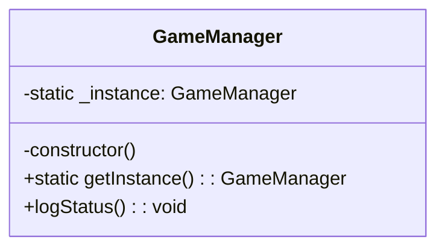

# 创建型模式


## 1 单例模式

### 1.1 描述和结构

单例模式（Singleton Pattern）是一种**创建型设计模式**，它确保某个类在系统中**只有一个实例**，并提供一个全局访问点来访问这个实例。

主要用于：

* 全局唯一资源管理器（如游戏的音频控制器、配置管理器、日志器等）
* 管理共享状态（如游戏状态、计分系统等）

```ts
// 单例类
class AudioManager {
    private static _instance: AudioManager;

    private constructor() {}

    static getInstance(): AudioManager {
        if (!AudioManager._instance) {
            AudioManager._instance = new AudioManager();
        }
        return AudioManager._instance;
    }

    playSound(name: string) {
        console.log(`播放音效：${name}`);
    }
}

// 使用
const audio1 = AudioManager.getInstance();
const audio2 = AudioManager.getInstance();
console.log(audio1 === audio2); // true
audio1.playSound("jump");

```

---



---

### 1.2 用途

**用处**

* 控制资源访问：例如音频控制器、数据库连接池、线程池等
* 管理共享状态或配置
* 保证全局唯一性，避免资源冲突

**常见应用场景**

* 游戏管理器（GameManager）
* 日志记录器（Logger）
* 配置读取器（ConfigManager）
* 缓存对象池、网络连接管理器

---

### 1.3 优缺点

| 优点               | 缺点                   |
| ---------------- | -------------------- |
| 保证系统中只有一个实例，节省资源 | 多线程环境下需要考虑线程安全       |
| 提供全局访问点，易于管理     | 隐式依赖全局状态，违背部分面向对象原则  |
| 可延迟初始化，提升性能      | 不易扩展，尤其在单元测试中难以模拟或替换 |
| 易于实现，适合小型管理类     | 滥用可能引发全局依赖、代码耦合      |

---
